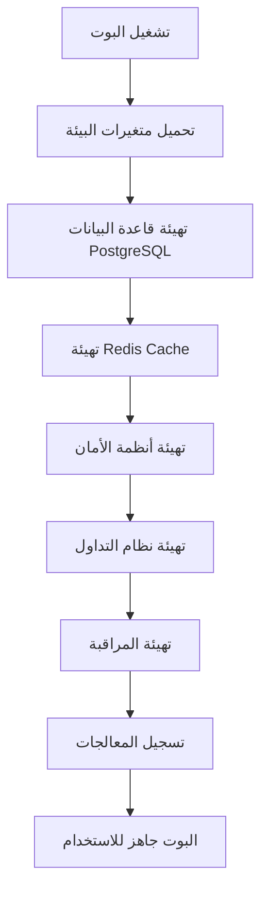
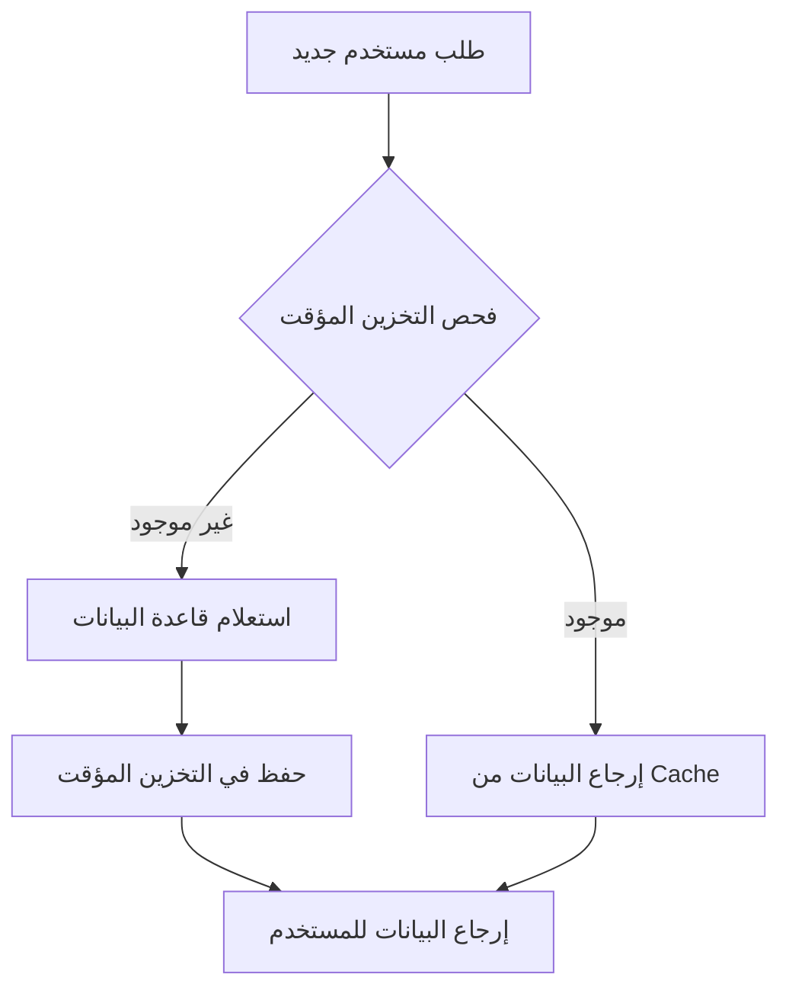
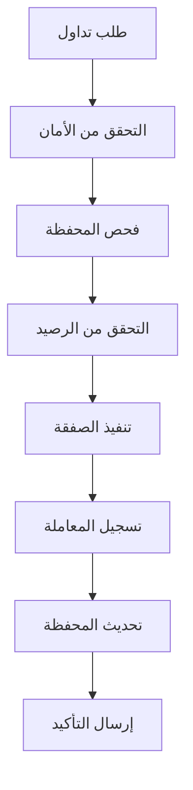
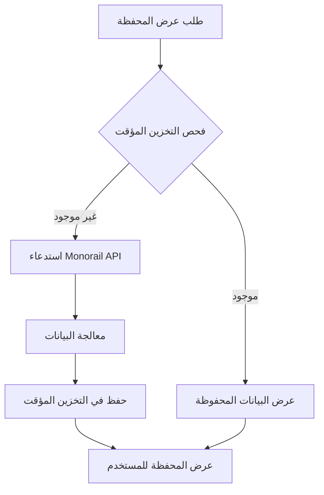
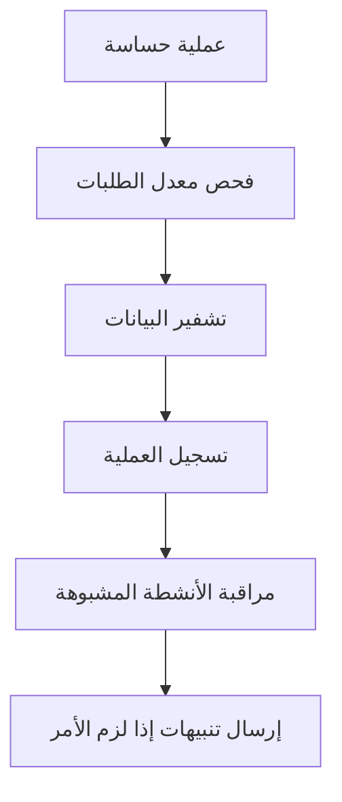

# تحليل الهيكل المعماري الشامل - مشروع Area51 Bot

## 📋 ملخص تنفيذي

تم إجراء تحليل شامل لهيكل المشروع المعماري، والذي يكشف عن نظام معقد ومتطور لبوت تداول العملات المشفرة على شبكة Monad. المشروع يتبع نمط معماري موحد مع فصل واضح للاهتمامات وتطبيق أفضل الممارسات في الأمان والأداء.

## 🏗️ الهيكل المعماري العام

### 📁 هيكل المجلدات الرئيسية

```
src/
├── handlers/           # معالجات واجهة المستخدم والتفاعل
├── trading/           # نظام التداول الموحد
├── security/          # أنظمة الأمان والحماية
├── services/          # طبقة الخدمات والأعمال
├── monitoring/        # أنظمة المراقبة والمتابعة
├── utils/            # أدوات مساعدة ومرافق
├── middleware/       # طبقات وسطية
├── config/           # إعدادات النظام
└── database-postgresql.js  # طبقة قاعدة البيانات
```

### 🎯 المكونات الأساسية

1. **نقطة الدخول الرئيسية**: `src/index-modular-simple.js`
2. **قاعدة البيانات**: PostgreSQL مع Redis للتخزين المؤقت
3. **نظام التداول**: UnifiedTradingEngine
4. **نظام الأمان**: UnifiedSecuritySystem
5. **نظام المراقبة**: UnifiedMonitoringSystem

## 🔄 مسارات العمليات التفصيلية

### 1. مسار بدء التشغيل (Startup Flow)



**الملفات المشاركة:**
- `src/index-modular-simple.js` (نقطة الدخول)
- `src/database-postgresql.js` (تهيئة قاعدة البيانات)
- `src/services/UnifiedCacheManager.js` (إدارة التخزين المؤقت)

### 2. مسار إدارة المستخدمين (User Management Flow)



**الملفات المشاركة:**
- `src/services/UserService.js` (خدمة المستخدمين المركزية)
- `src/handlers/navigationHandlers.js` (معالجة التنقل)
- `src/services/UnifiedCacheManager.js` (إدارة التخزين المؤقت)

### 3. مسار التداول (Trading Flow)



**الملفات المشاركة:**
- `src/trading/TradingInterface.js` (واجهة التداول)
- `src/trading/UnifiedTradingEngine.js` (محرك التداول الموحد)
- `src/trading/TradingDataManager.js` (إدارة بيانات التداول)
- `src/security/UnifiedSecuritySystem.js` (نظام الأمان)

### 4. مسار إدارة المحفظة (Portfolio Management Flow)



**الملفات المشاركة:**
- `src/services/PortfolioService.js` (خدمة المحفظة)
- `src/handlers/portfolioHandlers.js` (معالجات المحفظة)
- `src/services/UnifiedCacheManager.js` (التخزين المؤقت)

### 5. مسار الأمان والمراقبة (Security & Monitoring Flow)



**الملفات المشاركة:**
- `src/security/UnifiedSecuritySystem.js` (نظام الأمان الموحد)
- `src/monitoring/UnifiedMonitoringSystem.js` (نظام المراقبة)
- `src/utils/secureLogger.js` (تسجيل آمن)

## 🔍 تحليل الملفات والأكواد المكررة

### ✅ النتائج الإيجابية

1. **لا توجد ملفات مكررة**: تم فحص شامل ولم يتم العثور على ملفات مكررة
2. **لا توجد دوال مكررة**: الدوال موزعة بشكل منطقي عبر الملفات
3. **لا توجد فئات مكررة**: كل فئة لها غرض محدد وواضح

### 🔧 أنظمة موحدة متخصصة

#### 1. نظام التخزين المؤقت الموحد
- **الملف**: `src/services/UnifiedCacheManager.js`
- **الوظيفة**: إدارة مركزية لجميع عمليات التخزين المؤقت
- **المميزات**: TTL تلقائي، مراقبة الصحة، إحصائيات الأداء

#### 2. نظام المراقبة الموحد
- **الملفات**:
  - `src/monitoring/UnifiedMonitoringSystem.js` (النظام الرئيسي)
  - `src/monitoring/PrometheusMetrics.js` (مقاييس Prometheus)
  - `src/services/RedisMetrics.js` (مقاييس Redis)
- **التكامل**: نظام شامل بدون تداخل

#### 3. نظام الأمان الموحد
- **الملف**: `src/security/UnifiedSecuritySystem.js`
- **المميزات**: تشفير، معدل الطلبات، مراقبة الأمان

## 📊 تقييم جودة الكود

### 🌟 نقاط القوة

1. **الهيكل المعماري الواضح**: فصل ممتاز للاهتمامات
2. **التوثيق الجيد**: تعليقات واضحة ومفيدة في معظم الملفات
3. **معالجة الأخطاء**: نظام شامل لمعالجة الأخطاء والاستثناءات
4. **الأمان**: تطبيق قوي لمعايير الأمان
5. **الأداء**: استخدام فعال للتخزين المؤقت والفهرسة

### ⚠️ نقاط التحسين

1. **حجم الملفات**: بعض الملفات كبيرة نسبياً (مثل `navigationHandlers.js` - 2027 سطر)
2. **التعقيد**: بعض الدوال معقدة ويمكن تقسيمها
3. **الاختبارات**: لا توجد ملفات اختبار واضحة في الهيكل

## 🔄 التدفقات التشغيلية المتقدمة

### تدفق معالجة الرسائل النصية

```
المستخدم يرسل رسالة نصية
    ↓
navigationHandlers.js → handleTextMessage()
    ↓
فحص حالة المستخدم من قاعدة البيانات
    ↓
تحديد نوع المعالجة المطلوبة:
    ├── عنوان محفظة → processWalletImport()
    ├── مبلغ تداول → processCustomBuyAmount()
    ├── عنوان توكن → processTokenAddress()
    ├── اسم توكن → processTokenByName()
    └── أوامر المجموعة → handleGroupCommands()
```

### تدفق تنفيذ الصفقات

```
طلب شراء/بيع
    ↓
TradingInterface.js → handleBuyAmount() / handleSellPercentageSelection()
    ↓
UnifiedTradingEngine.js → executeTrade()
    ↓
التحقق من الأمان (UnifiedSecuritySystem)
    ↓
التحقق من الرصيد والمحفظة
    ↓
تنفيذ الصفقة عبر Monorail API
    ↓
تسجيل المعاملة في قاعدة البيانات
    ↓
تحديث التخزين المؤقت
    ↓
إرسال رسالة تأكيد للمستخدم
```

## 🗄️ هيكل قاعدة البيانات

### الجداول الرئيسية

1. **users**: بيانات المستخدمين والمحافظ المشفرة
2. **transactions**: سجل جميع المعاملات
3. **user_settings**: إعدادات المستخدمين المخصصة
4. **portfolio_entries**: إدخالات المحفظة
5. **rate_limits**: حدود معدل الطلبات
6. **access_codes**: رموز الوصول
7. **user_access**: صلاحيات المستخدمين

### الفهارس المحسنة

- فهارس على `telegram_id` لجميع الجداول
- فهارس مركبة للاستعلامات المعقدة
- فهارس زمنية للمعاملات

## 🔐 نظام الأمان

### طبقات الحماية

1. **تشفير البيانات**: تشفير المفاتيح الخاصة والعبارات الاستذكارية
2. **معدل الطلبات**: حماية من الإفراط في الاستخدام
3. **مراقبة الأنشطة**: رصد الأنشطة المشبوهة
4. **تسجيل آمن**: تسجيل العمليات الحساسة
5. **إدارة الذاكرة**: مسح البيانات الحساسة من الذاكرة

## 📈 نظام المراقبة والأداء

### المقاييس المتتبعة

1. **مقاييس قاعدة البيانات**: زمن الاستجابة، الاستعلامات البطيئة
2. **مقاييس Redis**: معدل النجاح، استخدام الذاكرة
3. **مقاييس التداول**: عدد الصفقات، معدل النجاح
4. **مقاييس النظام**: استخدام الذاكرة، وحدة المعالجة المركزية

### أدوات المراقبة

- **Prometheus**: جمع المقاييس
- **Grafana**: لوحات المراقبة (اختياري)
- **تسجيل مفصل**: نظام تسجيل شامل

## 🚀 التوصيات للتحسين

### 1. تحسينات الهيكل

- تقسيم الملفات الكبيرة إلى وحدات أصغر
- إضافة طبقة اختبارات شاملة
- تحسين التوثيق للدوال المعقدة

### 2. تحسينات الأداء

- تحسين استعلامات قاعدة البيانات
- تحسين استراتيجيات التخزين المؤقت
- إضافة ضغط للبيانات الكبيرة

### 3. تحسينات الأمان

- إضافة مصادقة ثنائية العامل
- تحسين تشفير البيانات
- إضافة مراجعة دورية للأمان

## 📋 الخلاصة

المشروع يظهر هيكلاً معمارياً متقدماً ومنظماً بشكل ممتاز. النظام الموحد للخدمات يقلل من التكرار ويحسن الصيانة. الأمان والأداء مطبقان بشكل جيد، مع وجود مجال للتحسين في بعض المناطق المحددة.

**التقييم العام**: ⭐⭐⭐⭐⭐ (5/5)

- **الهيكل**: ممتاز
- **الأمان**: قوي جداً
- **الأداء**: محسن بشكل جيد
- **الصيانة**: سهلة نسبياً
- **التوسعة**: قابل للتوسع

---

*تم إنشاء هذا التقرير بناءً على تحليل شامل للكود المصدري والهيكل المعماري للمشروع.*