# Area51 Telegram Bot - User Interface Flow

## Main User Journey Flowchart

```mermaid
flowchart TD
    A[User starts bot /start] --> B{User exists in cache/DB?}
    
    B -->|No| C[Create new user session]
    B -->|Yes| D[Load user data from cache/DB]
    
    C --> E[Show Main Interface]
    D --> E
    
    E --> F{User selects action}
    
    %% Main Menu Options
    F -->|💰 Buy| G[Buy Interface]
    F -->|💸 Sell| H[Sell Interface] 
    F -->|👛 Wallet| I[Wallet Management]
    F -->|📊 Portfolio| J[Portfolio View]
    F -->|📈 Categories| K[Token Categories]
    F -->|⚙️ Settings| L[Settings Menu]
    F -->|📤 Transfer| M[Transfer Interface]
    F -->|🔄 Refresh| N[Refresh Data]
    F -->|❓ Help| O[Help Information]

    %% Buy Flow
    G --> G1[Select Buy Amount]
    G1 --> G2{Amount Type}
    G2 -->|Preset| G3[0.1, 0.5, 1, 5, 10 MON]
    G2 -->|Custom| G4[Enter custom amount]
    G3 --> G5[Show Token Categories]
    G4 --> G5
    G5 --> G6[Select Token from Category]
    G6 --> G7[Confirm Purchase]
    G7 --> G8{Transaction Success?}
    G8 -->|Yes| G9[✅ Success Message + Explorer Link]
    G8 -->|No| G10[❌ Error Message]
    G9 --> E
    G10 --> E

    %% Sell Flow
    H --> H1{Has tokens in portfolio?}
    H1 -->|No| H2[❌ No tokens to sell]
    H1 -->|Yes| H3[Show Portfolio Tokens]
    H2 --> E
    H3 --> H4[Select Token to Sell]
    H4 --> H5[Select Sell Percentage]
    H5 --> H6{Percentage Type}
    H6 -->|Preset| H7[25%, 50%, 75%, 100%]
    H6 -->|Custom| H8[Enter custom percentage]
    H7 --> H9[Show Sell Confirmation]
    H8 --> H9
    H9 --> H10[Apply 99.99% buffer if 100%]
    H10 --> H11[Execute Sell Transaction]
    H11 --> H12{Transaction Success?}
    H12 -->|Yes| H13[✅ Success + Clear Cache]
    H12 -->|No| H14[❌ Error + Force Refresh]
    H13 --> E
    H14 --> E

    %% Portfolio Flow
    J --> J1{Portfolio cached?}
    J1 -->|Yes| J2[Load from Redis Cache]
    J1 -->|No| J3[Fetch from Monorail API]
    J2 --> J4[Display Portfolio]
    J3 --> J5[Cache for 1 minute]
    J5 --> J4
    J4 --> J6{User Action}
    J6 -->|Sell Token| H4
    J6 -->|Refresh| J7[Force refresh from API]
    J6 -->|Back| E
    J7 --> J3

    %% Wallet Management
    I --> I1{Has wallet?}
    I1 -->|No| I2[Wallet Creation Options]
    I1 -->|Yes| I3[Wallet Info Display]
    I2 --> I4{Creation Type}
    I4 -->|Generate| I5[Generate New Wallet]
    I4 -->|Import| I6[Import Private Key]
    I5 --> I7[Save to Database]
    I6 --> I7
    I7 --> I3
    I3 --> I8{Wallet Action}
    I8 -->|Export Key| I9[Security Confirmation]
    I8 -->|Delete| I10[Delete Confirmation]
    I8 -->|Back| E
    I9 --> I11[Reveal Private Key]
    I10 --> I12[Confirm Delete Wallet]
    I11 --> E
    I12 --> I13[Delete from DB + Clear Cache]
    I13 --> E

    %% Settings Flow
    L --> L1[Settings Menu]
    L1 --> L2{Setting Type}
    L2 -->|Turbo Mode| L3[Toggle Turbo Mode]
    L2 -->|Slippage| L4[Coming Soon]
    L2 -->|Gas| L5[Coming Soon]
    L2 -->|Notifications| L6[Coming Soon]
    L2 -->|Back| E
    L3 --> L7{Current Status}
    L7 -->|Disabled| L8[Enable Turbo Confirmation]
    L7 -->|Enabled| L9[Disable Turbo Mode]
    L8 --> L10[Update DB + Cache]
    L9 --> L10
    L10 --> L1

    %% Categories Flow
    K --> K1[Show Token Categories]
    K1 --> K2[Verified, Stablecoins, Meme, etc.]
    K2 --> K3[Select Category]
    K3 --> K4[Show Tokens with Pagination]
    K4 --> K5{User Action}
    K5 -->|Buy Token| G6
    K5 -->|Next Page| K6[Load Next Page]
    K5 -->|Back| K1
    K6 --> K4

    %% Transfer Flow
    M --> M1[Enter Recipient Address]
    M1 --> M2[Enter Amount]
    M2 --> M3[Validate Address & Amount]
    M3 --> M4{Valid?}
    M4 -->|No| M5[❌ Validation Error]
    M4 -->|Yes| M6[Show Transfer Confirmation]
    M5 --> M1
    M6 --> M7[Execute Transfer]
    M7 --> M8{Success?}
    M8 -->|Yes| M9[✅ Transfer Complete]
    M8 -->|No| M10[❌ Transfer Failed]
    M9 --> E
    M10 --> E

    %% Refresh Flow
    N --> N1[Clear All Caches]
    N1 --> N2[Fetch Fresh Data]
    N2 --> N3[Update Portfolio & Balance]
    N3 --> N4[Show Updated Main Interface]
    N4 --> E

    %% Error Handling
    G10 --> P[Log Error + Clear Cache]
    H14 --> P
    M10 --> P
    P --> Q[Show User-Friendly Error]
    Q --> E

    %% Cache Management
    R[Cache Layer] --> R1{Cache Type}
    R1 -->|User Data| R2[24h TTL]
    R1 -->|Portfolio| R3[1min TTL]
    R1 -->|Balance| R4[1min TTL]
    R1 -->|MON Price| R5[5min TTL]

    style A fill:#e1f5fe
    style E fill:#f3e5f5
    style G9 fill:#e8f5e8
    style H13 fill:#e8f5e8
    style G10 fill:#ffebee
    style H14 fill:#ffebee
```

## Key User Interface Features

### 1. **Main Interface (9 Buttons)**
- 💰 Buy | 💸 Sell
- 👛 Wallet | 📊 Portfolio  
- 📈 Categories | ⚙️ Settings
- 📤 Transfer | 🔄 Refresh
- ❓ Help

### 2. **Buy Flow**
- Amount Selection: 0.1, 0.5, 1, 5, 10 MON + Custom
- Category Selection: Verified, Stablecoins, Meme, etc.
- Token Selection with pagination
- Instant confirmation with gas estimation

### 3. **Sell Flow**
- Portfolio-based token selection
- Percentage options: 25%, 50%, 75%, 100% + Custom
- 99.99% buffer for 100% sells
- Real-time MON output estimation

### 4. **Portfolio Management**
- Real-time balance display
- USD value calculations
- Token filtering (min value threshold)
- Cache optimization (1-minute TTL)

### 5. **Wallet Security**
- Two-step private key reveal
- Secure wallet deletion confirmation
- Import/Export functionality
- Address validation

### 6. **Settings & Preferences**
- Turbo Mode toggle (50 gwei vs 100 gwei)
- Future: Slippage, Gas, Notifications
- User preference persistence

### 7. **Error Handling**
- Automatic cache invalidation on errors
- User-friendly error messages
- Transaction retry mechanisms
- Fallback to memory when Redis unavailable
